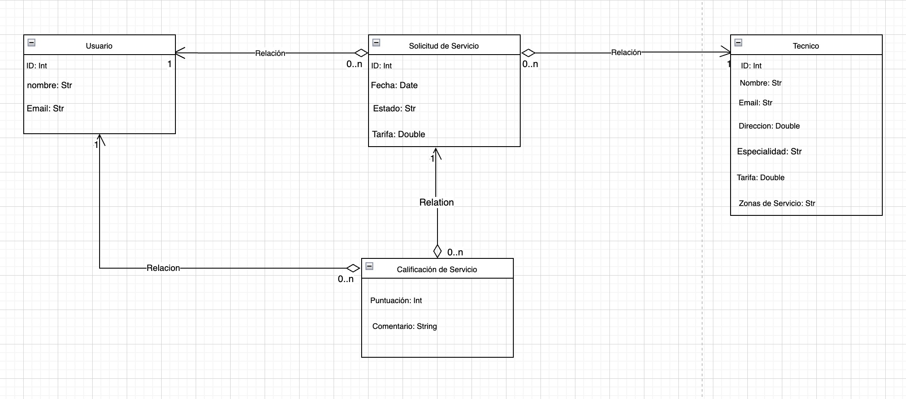
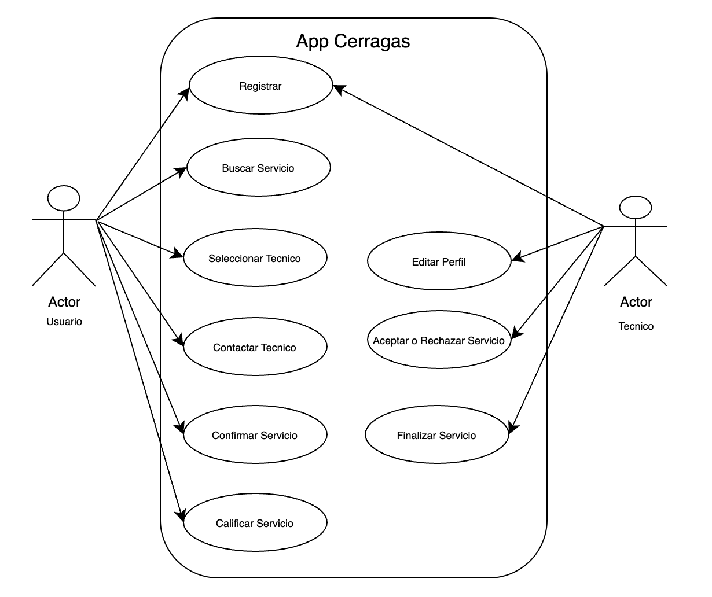

# cerragas_test_geo
App Cerragas 🔧🚰

Aplicación móvil multiplataforma que conecta a usuarios con técnicos de gasfitería y cerrajería en situaciones de emergencia, de forma rápida, transparente y confiable.

Proyecto desarrollado como Proyecto de Título para optar al grado de Ingeniero en Computación e Informática — Universidad Andrés Bello (2025).

Autor: José Ignacio Bravo Castillo Profesores guía: Yrene Santiago Paredes, Tomás Sepúlveda Caroca

📌 El problema

En situaciones de emergencia como una fuga de agua o la pérdida de llaves, los usuarios enfrentan dificultades reales para encontrar técnicos confiables y con precios claros. App Cerragas nace para resolver esa fricción, conectando directamente a quien necesita el servicio con el técnico adecuado, con transparencia en tarifas, calificaciones y disponibilidad.

🎯 Objetivo

Resolver la dificultad de encontrar servicios técnicos confiables y transparentes en situaciones de emergencia, mediante una plataforma que da visibilidad a los técnicos y confianza a los usuarios.

✨ Funcionalidades principales
Autenticación y registro diferenciado: flujos independientes de registro para usuarios (clientes) y para técnicos.
Búsqueda de técnicos por especialidad, tarifa máxima, calificación mínima y distancia.
Geolocalización en tiempo real para encontrar técnicos disponibles cerca del usuario.
Perfil de técnico con calificación promedio, tarifa base, contacto directo (llamada / WhatsApp) y últimas calificaciones recibidas.
Gestión de solicitudes de servicio: contacto, confirmación, aceptación o rechazo por parte del técnico, y finalización del servicio.
Historial de servicios tanto para el usuario (servicios solicitados) como para el técnico (servicios atendidos).
Sistema de calificación de servicio, con puntuación y comentario al finalizar cada atención.
Carga de imágenes y documentos (foto de perfil, evidencia del servicio).
🏗️ Arquitectura

El dominio de la aplicación se modela en torno a cuatro entidades principales:

Usuario: genera múltiples solicitudes de servicio.
Solicitud de Servicio: representa un servicio de cerrajería o gasfitería, con estado y tarifa asociada.
Técnico: atiende una o varias solicitudes, según especialidad y zona de servicio.
Calificación de Servicio: permite al usuario valorar la experiencia una vez finalizado el servicio.

  

Los dos actores principales que interactúan con el sistema son el Usuario (Cliente) y el Técnico, cada uno con su propio flujo de casos de uso:

  

🛠️ Stack técnico
Categoría	Tecnología
Lenguaje / Framework	Dart, Flutter
Backend / BaaS	Firebase (Auth, Cloud Firestore, Storage, Analytics, App Check)
Geolocalización	geolocator, geo_firestore_flutter
UI / Componentes	font_awesome_flutter, flutter_rating_bar
Internacionalización	intl (localización es_CL)
Archivos e imágenes	image_picker, file_picker
Otros	url_launcher (llamadas y WhatsApp directo)

La gestión de estado se maneja de forma nativa con StatelessWidget/Navigator, sin librerías externas de manejo de estado.

📱 Capturas de pantalla
Búsqueda de técnico	Perfil de técnico	Historial de servicios
Mostrar imagen	Mostrar imagen	Mostrar imagen
📋 Metodología de desarrollo

El proyecto se desarrolló bajo metodología ágil Scrum, en 5 sprints de 2 semanas cada uno, lo que permitió flexibilidad para gestionar e implementar cambios a partir de la retroalimentación recibida en cada entrega de avance.

Alcance del proyecto:

✅ Diseño de experiencia e interfaz de usuario (UX/UI)
✅ Desarrollo de prototipo funcional
✅ Validación y pruebas

Fuera de alcance:

❌ Métodos de pago integrados
❌ Especialidades adicionales fuera de cerrajería y gasfitería
❌ Escalabilidad avanzada / cobertura geográfica ampliada
🚀 Cómo ejecutar el proyecto
bash
# Clonar el repositorio
git clone https://github.com/ignaciob14/App_Cerragas.git
cd App_Cerragas

# Instalar dependencias
flutter pub get

# Ejecutar en un emulador o dispositivo conectado
flutter run

⚠️ El proyecto requiere un archivo firebase_options.dart propio (generado con flutterfire configure) y un proyecto de Firebase configurado con Authentication, Cloud Firestore, Storage y App Check habilitados.

✅ Conclusiones del proyecto
Se desarrolló un prototipo funcional y validado que responde eficazmente a la necesidad de conectar usuarios con técnicos de emergencia de forma transparente y confiable.
Se cumplieron los objetivos de diseño UX/UI, desarrollo de funcionalidades MVP (Flutter/Firebase) y validación del sistema.
La metodología Scrum fue clave para gestionar el proyecto de forma flexible, superar desafíos técnicos y entregar valor de forma incremental.
Valor para usuarios: confianza, transparencia y eficiencia al contratar servicios técnicos.
Valor para técnicos: visibilidad y una plataforma para su desarrollo profesional.

📄 Proyecto desarrollado en el marco del proceso de Titulación de Ingeniería en Computación e Informática — Universidad Andrés Bello, Junio 2025.

